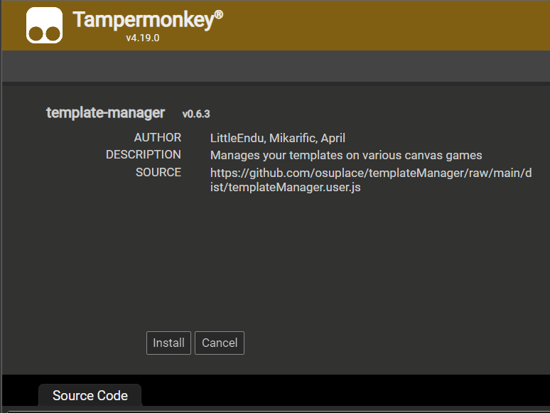

*(Hướng dẫn gốc của [r/placevn](https://discord.gg/r-placevietnam-960076480916901948) và r/osuplace, cảm ơn mọi người)*
-------
<h1 align="center">
  

  <a href="https://discord.gg/r-placevietnam-960076480916901948">Tham gia Discord MixiGaming và theo dõi trên các nguồn khác để tác chiến, mong các bạn không đánh đơn lẻ</a>
</h1>

# SAU ĐÂY SẼ LÀ HƯỚNG DẪN ĐỂ CÁC BẠN CÓ THỂ SỬ DỤNG ĐƯỢC CÁC CÔNG CỤ VẼ ARTWORK !
- Hướng dẫn cho PC

## TAMPERMONKEY

*Tampermonkey là công cụ để bạn có thể manipulate những gì bạn thấy trên trang web của mình.*

### Cài đặt: 

- Nếu bạn xài Chrome: https://chrome.google.com/webstore/detail/dhdgffkkebhmkfjojejmpbldmpobfkfo
- Nếu bạn xài Edge: https://microsoftedge.microsoft.com/addons/detail/iikmkjmpaadaobahmlepeloendndfphd
- Nếu bạn xài Firefox: https://addons.mozilla.org/en-US/firefox/addon/tampermonkey/
- Nếu bạn xài Safari: https://apps.apple.com/us/app/tampermonkey/id1482490089
- Nếu bạn xài Opera: https://addons.opera.com/en/extensions/details/tampermonkey-beta/

Chỉ cần nhấn vào Install Extension, bạn đã cài đặt được Tampermonkey cho trình duyệt của bạn. Đây là extension cần có để chạy tiếp 2 công cụ ở phía dưới đây. 
## KHUNG OVERLAY

*Khung overlay (hay template/ template - manager) là công cụ để các bạn có thể nhìn thấy những ô màu mà chúng mình cập nhật, từ đó các bạn sẽ biết vẽ ô nào là màu nào.*
- Cài đặt: https://github.com/osuplace/templateManager/raw/main/dist/templateManager.user.js

- Click vào link bên trên -> Nhấn Install khi tab mới hiện ra
Image
- Vào trang chủ của sự kiện r/place (reddit.com/r/place), sẽ thấy nút settings màu trắng trôi lơ lững như bên dưới. Click vào đó sẽ hiện ra menu như hình dưới.
Image
Tại ô "Template URL", paste đường link bên dưới vào và bấm "Always Load". Sau khi F5 lại trang, bạn sẽ thấy những chấm cần tô hiện đè (overlay) trên màn hình r/place

Link: https://raw.githubusercontent.com/LiquidRekto/rplacevnhideout/master/vnflag.json
Image

Đây là file JSON (chính thức?) của r/placevietnam.

Hãy kiểm tra update của script overlay!
-----------------
- Làm lại bước 2 :)

Hướng dẫn setup:
-----------------

1. Tải [Tampermonkey](https://www.tampermonkey.net/)

2. Tải [script overlay](https://github.com/osuplace/templateManager/raw/main/dist/templateManager.user.js)

3.1. [Vào template](https://new.reddit.com/r/place/?jsontemplate=https://mixiplace.minhquang.xyz/json/template.json)

Lưu ý: nếu không thấy template thì hãy reload

3.2. Nếu cách này không được thì vào menu cài đặt 
 
và dán link **https://mixiplace.minhquang.xyz/json/template.json** vào mục "Template URL"

4. Nhấn "Always allow all domains"

<h3>Video hướng dẫn setup</h3>

https://github.com/ntbeastboy/rplacevietnam/assets/99698334/0d6baaae-b78a-4e8e-a8b3-4d77904ffb51

FAQ
-------------------
1. Tình trạng overlay không trùng với khối.

**CHỈNH ZOOM CỦA TRÌNH DUYỆT THÀNH 100%**

**Fix**: Chỉnh "Scale & layout" trong windows setting xuống 100%

--------------

Update tọa độ
-------------------
Tọa độ tính theo kiểu khác nên vào https://charity.pxls.space/ để place design rồi thay coordinate vào file JSON

